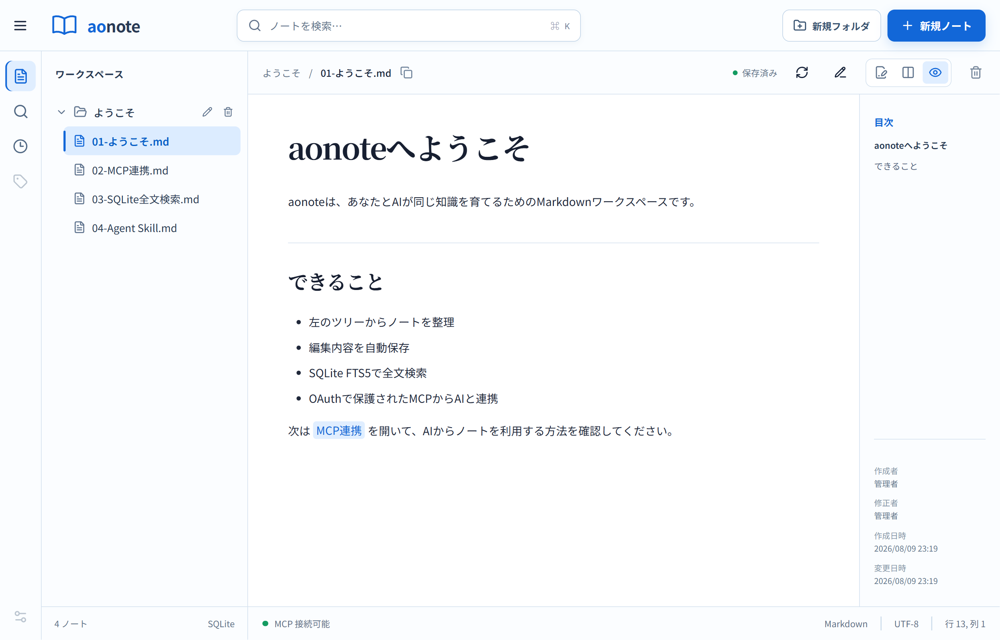

# 

aonoteは、個人とAIが同じMarkdownノートを扱うための軽量なWebワークスペースです。Python、React、SQLiteで動作し、検索はSQLite FTS5で行います。



## 主な機能

- 左側にフォルダ／ファイルツリー、右側にMarkdownの編集／プレビューを持つ画面構成
- Markdownの編集、分割プレビュー、自動保存、更新競合の検出
- SQLite FTS5（trigram）によるタイトル・ファイル名・本文の全文検索
- 最近のノート、Wikiリンク、バックリンク、更新履歴
- MCP Streamable HTTP互換のJSON-RPCエンドポイント
- OAuth 2.1の認可コード＋PKCE（S256）、DCR、Protected Resource Metadata
- MCPツール：一覧、取得、検索、作成、更新、削除
- ノートの作成者・修正者と作成日時・変更日時の表示
- ノートの名前変更・移動、最大階層を設定できるフォルダ作成

## ローカル開発

Python 3.12以上とNode.js 20.19以上、または22.12以上を利用してください。

```bash
python -m venv .venv
source .venv/bin/activate
pip install -e '.[dev]'
npm install
npm run build
uvicorn aonote.main:app --reload --host 127.0.0.1 --port 8000
```

`http://127.0.0.1:8000` を開きます。開発環境では既定でブラウザ認証を省略します。認証画面も確認する場合は次のように起動します。

フォルダは既定で3階層まで作成できます。`AONOTE_MAX_FOLDER_DEPTH`で上限を変更できます。

```bash
AONOTE_DEV_BYPASS_AUTH=false AONOTE_ADMIN_PASSWORD='local-password' uvicorn aonote.main:app
```

## Docker

```bash
cp .env.example .env
# .envの公開URLと十分に長い管理パスワードを変更
docker compose up --build -d
```

本番環境ではCaddyやnginxなどで公開HTTPS化してください。`AONOTE_BASE_URL` は外部から見えるHTTPSのオリジンと完全に一致させます。

## ChatGPTから接続

MCP URLは `https://あなたのホスト/mcp` です。ChatGPTの開発者モードでプラグインを作成し、このURLを接続先に指定します。接続時にaonoteのOAuth同意画面が開き、管理パスワードで許可できます。
同意画面では表示名を入力し、クライアントが要求した範囲内で閲覧・検索・書き込み権限を個別に選択できます。読み取り専用のAIには書き込み権限を外して接続してください。MCPから更新したノートには `表示名(ChatGPT経由)` のように修正者が記録されます。

aonoteは次のディスカバリーURLを公開します。

- `/.well-known/oauth-protected-resource`
- `/.well-known/oauth-authorization-server`
- `/oauth/register`（Dynamic Client Registration）
- `/oauth/authorize`、`/oauth/token`、`/oauth/revoke`

ChatGPT接続には公開HTTPSが必要です。ローカル開発ではMCP InspectorまたはHTTPSトンネルを利用してください。OpenAIの現行要件は[Authentication](https://developers.openai.com/plugins/build/auth)と[Connect and test your plugin](https://developers.openai.com/plugins/deploy/connect-chatgpt)を確認してください。

## MCPツール

| ツール | 必要スコープ | 用途 |
|---|---|---|
| `list_notes` | `notes:read` | 最近のノートを一覧 |
| `get_note` | `notes:read` | Markdown本文とバージョンを取得 |
| `list_folders` | `notes:read` | 移動先フォルダのIDと階層を一覧 |
| `search_notes` | `notes:search` | SQLite FTS5で全文検索 |
| `create_note` | `notes:write` | ノートを作成 |
| `update_note` | `notes:write` | バージョン付きで安全に更新 |
| `rename_note` | `notes:write` | ノートのファイル名を変更 |
| `move_note` | `notes:write` | ノートを別のフォルダへ移動 |
| `delete_note` | `notes:write` | 明示確認後に削除 |

## セキュリティ上の注意

- `.env`をコミットしないでください。
- `data/`や`*.sqlite3`など、実際のノートを含むデータベースをコミットしないでください。
- 本番では`AONOTE_DEV_BYPASS_AUTH=false`を必ず使用してください。
- アクセストークンは1時間、リフレッシュトークンは30日で失効します。
- 自作OAuthサーバは小規模・個人用途向けです。公開サービスや複数ユーザー用途では、Auth0など確立したIdPへの置き換えを推奨します。
- リバースプロキシでレート制限、アクセスログ、TLS更新を設定してください。

## ライセンス

aonote本体は[MIT License](LICENSE)で公開されています。著作権表示とライセンス文を保持することで、商用利用、改変、再配布、私的利用が可能です。

主な実行時依存ライブラリは次のライセンスで提供されています。

| ライブラリ | 用途 | ライセンス |
|---|---|---|
| FastAPI | Web API | MIT |
| Uvicorn | ASGIサーバー | BSD-3-Clause |
| python-multipart | OAuthフォーム処理 | Apache-2.0 |
| React / React DOM | フロントエンドUI | MIT |
| Lucide React | UIアイコン | ISC |
| Mermaid | Markdown内の図表 | MIT |
| react-markdown / remark-gfm | Markdown・GFM表示 | MIT |
| IBM Plex Mono | エディター用Webフォント | SIL Open Font License 1.1 |
| Noto Sans JP / Noto Serif JP | 日本語Webフォント | SIL Open Font License 1.1 |

各ライブラリの著作権表示、開発・テスト用ライブラリ、主な推移的依存関係については[THIRD_PARTY_NOTICES.md](THIRD_PARTY_NOTICES.md)を参照してください。依存ライブラリには、それぞれのライセンス条件が別途適用されます。

## テスト

```bash
pytest
npm run build
```
